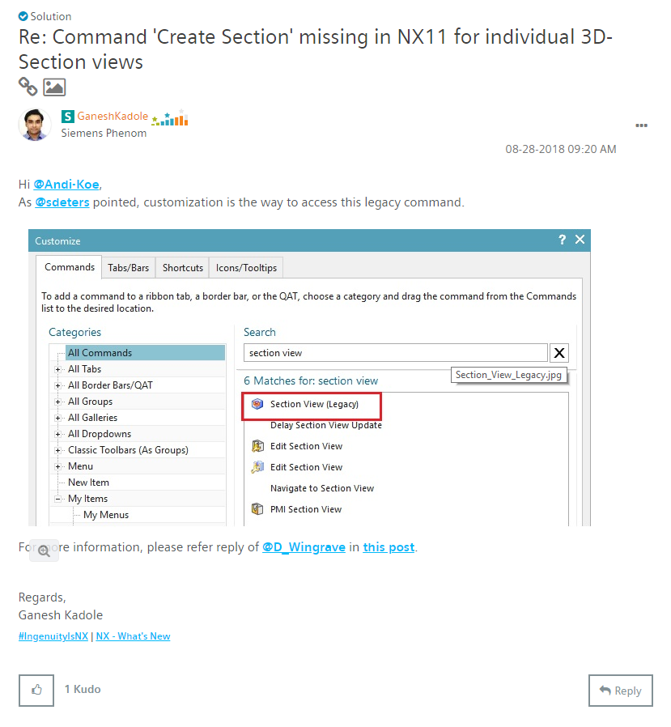
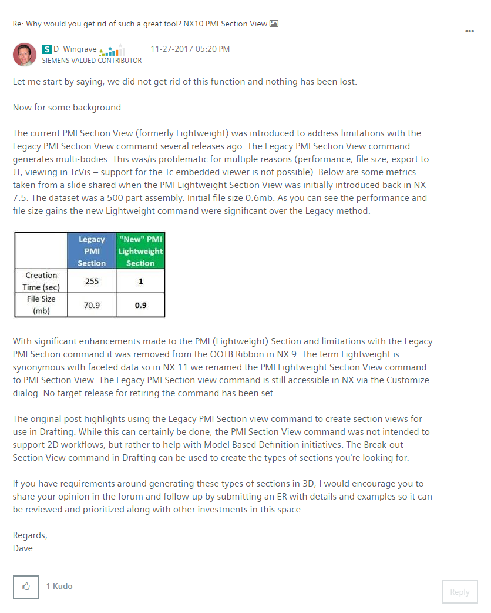

# Finding the (legacy) section view command
This legacy section command allows a much larger range of section-ability.
The legacy tool allows the user to create a section based on a sketch. This way, the shape of the section can be infinitely adjusted to create great views for presentation.  
The existing tool is limited to sectioning everything by selecting one plane.

**right-click toolbar > customize > search "section"**  
section view (legacy)  

https://community.plm.automation.siemens.com/t5/NX-Design-Forum/Command-Create-Section-missing-in-NX11-for-individual-3D-Section/m-p/520357/highlight/true#M26294
>
>--------------------------------
>

[ Back to index ](README.md)  
