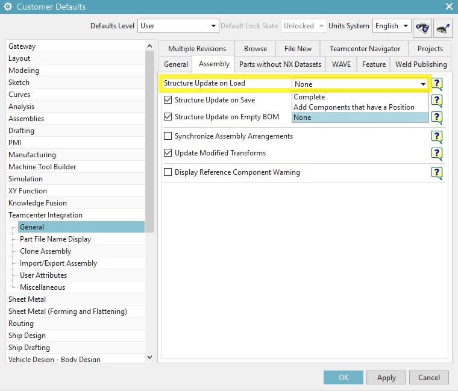

[ Back to index ](README.md)
## Unexpected structure of in-sync assembly

### Issue:
Opening assembly in NX brings the following error  
```
Unexpected structure of in-sync assembly
The following part is marked as in-sync with NX but has unexpected structure in Teamcenter:

[ affected assembly name/number ]

Although this assembly is marked as in-sync with Teamcenter, it has one or more components
in its Teamcenter structure that are not in the NX assembly file structure. If you want these
components in your NX structure you don't need to do anything else, since NX has loaded
the structure that way. If you do not want these components in your NX structure, load
the assembly with structure update on load set to None and then save it to Teamcenter.
```

### Where to find "structure update on load":
- Display the "Customer Defaults" dialog box  
`File tab → Utilities → Customer Defaults`  
- Navigate to "Structure Update on Load" dialog box  
`Teamcenter Integration [general] → Assembly tab`  



### Details:
http://www2.me.rochester.edu/courses/ME204/nx_help/index.html#uid:use_ugmgr_defaults_pref_cust_detail_desc_dfault  
http://www2.me.rochester.edu/courses/ME204/nx_help/index.html#uid:unsync_prod_struct  

[ Back to index ](README.md)