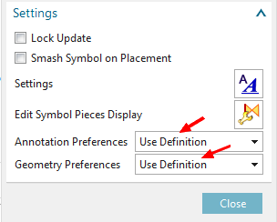

[ Back to index ](README.md)
## NX TITLE BLOCKS UPDATED FOR NX12
The JLab NX drawing templates have been updated with new title block symbols that won't blank out when editing in NX12.  There is now only one symbol per sheet instead of multiple symbols on different layers.

Edit the Title Block text attributes as usual, but note that the Project/ System/ Subsystem entries are pre-populated with code instead of asterisks. The code can be typed over if custom text is required.  Note that the Drawing Number, Name, and Revision are locked down and cannot be edited.

When starting a new drawing, the Project/System/Subsystem text may vary, depending on whether the model was made in NX9 or NX12.  After saving the drawing, some lines may appear blank but can still be edited.

## FOR EXISTING DRAWINGS - REPLACE BROKEN TITLE BLOCK WITH NEW SYMBOL

1. Drag old (broken) symbol down below the border to keep temporarily as reference.

2. Drag in the new title block symbol from:
Custom Symbol Library > JLAB Toolkit > Title Blocks Inches (or Title Blocks Millimeters)
    - CUSTOM SYMBOL SETTINGS:  
  set Annotation Preferences and Geometry Preferences are to `Use Definition`.  
  
    
 

3. Place the symbol anchor point at the lower right corner of the sheet (gray dashed border).

4.	Double-click title block text (or Right-click > Edit) to edit contents. Use the old symbol as reference.  
    - Attributes can be edited as usual, but note that Project/System/Subsystem entries are pre-populated with code to pull attributes from Teamcenter.  Type over the code if custom text is required.
    - Note that Drawing Number, Name, and Revision letter cannot be edited.

5.	Delete the old symbol and save the drawing.

[ Back to index ](README.md)
